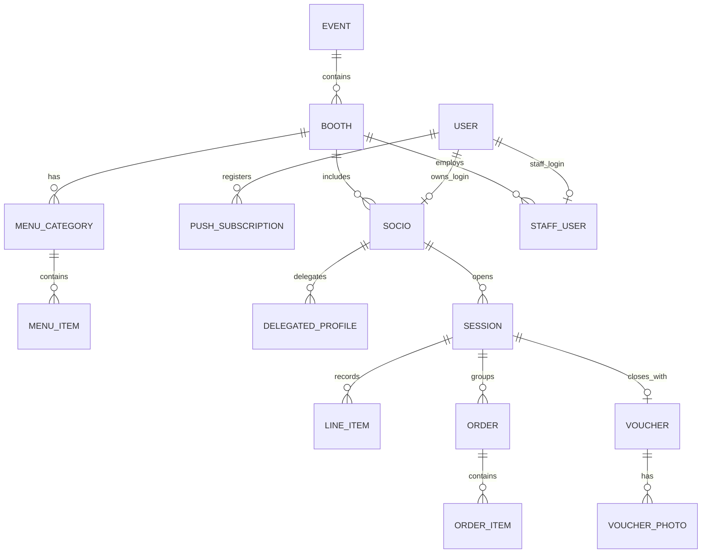

# SaaS MVP para digitalizar cuentas y pedidos por socio en casetas de feria

## Resumen ejecutivo

Este informe diseña un MVP de SaaS para sustituir el sistema tradicional de “papelitos con rayas” por un flujo digital basado en **cuentas efímeras por visita**: el socio abre cuenta en barra, se van añadiendo consumos (por barra y/o desde el móvil), el socio ve en tiempo real lo servido, lo pendiente y el total, y al irse se cierra la cuenta y se adjunta una **foto del talón/vale** como respaldo. El punto crítico del producto no es la tecnología sino la **velocidad operativa**: cualquier acción de camarero debe resolverse en ~2 segundos con 1–2 toques y sin fricción cognitiva.

La interfaz del socio se implementa como **PWA móvil** (instalable) con estados en tiempo real y avisos “multicanal” (notificación del sistema + pantalla a todo color + vibración + audio opt-in). La arquitectura combina **WebSocket** (tiempo real cuando la app está abierta) citeturn5search11turn5search3 y **Web Push** para avisos cuando no lo está: el Push API entrega mensajes a un **service worker** citeturn4search13turn5search19turn5search7 y las notificaciones se muestran con la Notifications API (incluido `showNotification()` desde el service worker). citeturn4search2turn4search6turn0search11

Limitación determinante: en **iOS**, el Web Push para web apps requiere que el usuario **añada la PWA a la pantalla de inicio** y solicite permiso tras interacción del usuario. citeturn0search13turn0search17turn1search25turn8view2 Esto obliga a diseñar onboarding y fallback para quienes no instalen la PWA.

Para conectividad irregular, el MVP debe ser “resiliente”: caché de App Shell con service worker y estrategias tipo *stale-while-revalidate* para evitar “microcortes”, citeturn1search2turn1search14turn1search34turn5search37 y cola local para acciones del socio (y, si se desea, del camarero) en **IndexedDB**. citeturn5search16turn5search0 No se debe basar el funcionamiento en Background Sync porque Safari/iOS no lo soporta (al menos de forma general), de modo que el reintento debe realizarse al reabrir la app o al reanudarse el service worker. citeturn8view0turn8view1turn5search1turn5search9

Supuestos explícitos por falta de información: modelo de precios y contratos, reglas concretas de cada feria/caseta, catálogo inicial de productos y políticas internas de custodia de talones. Estas variables afectan a términos legales, facturación y retención; aquí se proponen buenas prácticas y puntos de decisión.

## Visión de producto y roles

La visión es un “sistema operativo” de caseta centrado en la **cuenta por socio** (no solo en el pedido). Debe mejorar tres fricciones tradicionales:

1) **Transparencia para el socio**: qué le han servido, qué está pendiente, cuánto suma, y qué consumió en visitas anteriores (con evidencia).  
2) **Fluidez de barra**: el camarero registra consumos más rápido que con papel; el socio puede añadir pedidos desde el móvil para evitar colas, sin romper la dinámica del autoservicio.  
3) **Conciliación post-consumo**: cierre de cuenta + foto del talón/vale como respaldo digital, reduciendo disputas.

La PWA se apoya en estándares web: Web App Manifest para instalación citeturn1search5turn1search9, service workers para caché/offline y eventos push citeturn1search34turn5search15, y Push/Notifications para notificaciones del sistema citeturn4search13turn4search6.

### Roles y responsabilidades

**Socio**
- Inicia sesión y se autentica con 2FA (o passkey + factor adicional según política).
- Accede siempre a su **cuenta activa** (si existe): servido / pendiente / total.
- Puede crear pedidos desde el móvil (perfil propio o delegado).
- Cierra cuenta en barra físicamente con talón/vale; sube foto del talón para histórico.

**Camarero (barra)**
- Abre cuenta a un número de socio (verificación visual mostrando talonario/vales).
- Añade consumos con 1 toque (modo ultra-rápido).
- Marca estados operativos: “preparando / listo / entregado” cuando aplique.
- Cierra cuenta (total calculado por sistema) y registra talón.

**Empresario/gestor**
- Configura evento/caseta, carta y precios.
- Da de alta camareros y define permisos.
- Consulta métricas (rendimiento, adopción, incidencias). Aunque no sea objetivo “control del consumo”, sí es responsable del sistema y de su operativa.

**Cocina (si existe)**
- Ve cola de pedidos de cocina y cambia estados.
- No interfiere con bebidas/servicio inmediato.

## Flujos UX y estados

### Principios UX irrenunciables

- Acciones de camarero: **≤ 2 segundos** (medible).  
- 0 escritura en servicio normal; solo cifra de socio (o escaneo opcional).  
- Botones grandes, repetición rápida (x2/x3/x5), deshacer (“undo”) inmediato.  
- “Nunca bloquear”: ante error de red, registrar localmente y mostrar estado, o degradar a modo emergencia con instrucciones claras.

### Máquina de estados de una cuenta

Una “cuenta” es una **sesión efímera por visita**.

Estados propuestos:
- `NO_ACTIVA` (no hay cuenta abierta)
- `ABIERTA`
- `CERRANDO` (totales congelados, pendiente talón/foto)
- `CERRADA`
- `ANULADA` (errores/duplicados; solo gestor)

Transiciones clave:
- Abrir cuenta: barra → `ABIERTA`  
- Añadir consumos/pedidos: permanece en `ABIERTA`  
- Cerrar cuenta: barra → `CERRANDO` → (talón OK) → `CERRADA`

### PWA móvil del socio

#### Pantallas del socio

**Inicio / Login**
- Opción recomendada: “Acceso con passkey” (si disponible) y/o “Acceso con código + 2FA”.
- “Modo invitado” (solo informativo) desactivado por defecto si se exige seguridad.

Autenticación fuerte vía WebAuthn permite credenciales de clave pública y MFA sin SMS si se configura así. citeturn3search0turn3search1turn3search5

**Home del socio**
- 3 tarjetas:
  - “Cuenta activa”
  - “Histórico”
  - “Mis perfiles delegados”

**Cuenta activa**
- Secciones fijas:
  - **Servido** (lo confirmado/entregado)
  - **Pendiente / En preparación** (si hay cocina o cola)
  - **Total** con desglose por categorías
- Acciones:
  - “Añadir pedido” (flow de pedido móvil)
  - “Cancelar pedido” (solo si está en estado temprano)
  - “Ayuda / incidencias”

**Añadir pedido**
- Catálogo reducido primero (top ventas) + buscador por categorías.
- Confirmación en 1 pantalla: ítems + cantidades + “Enviar”.
- Tras enviar:
  - Placa de estado (“Recibido”, “En preparación”, “Listo”, “Entregado”).
  - Reintento automático si falla (ver conectividad).

**Histórico**
- Lista de cuentas cerradas con:
  - Fecha/hora
  - Total
  - Estado de talón: “foto adjunta / pendiente”
- Al entrar en una cuenta: detalle de consumos + foto del talón (si existe).

**Subida de foto del talón**
- UI muy simple:
  - “Hacer foto”
  - “Recortar”
  - “Confirmar”
- Metadatos mínimos: cuenta, fecha, importe total, (opcional) número de talón.

#### Estados de notificación (socio)

El socio debe recibir avisos “listo para recoger”. Se recomienda una estrategia híbrida:

1) **Tiempo real** cuando la PWA está abierta usando WebSocket. citeturn5search11turn5search3  
2) **Web Push** si está cerrada: Push API → service worker → Notifications API. citeturn4search13turn5search19turn4search2turn4search6  

En iOS, Web Push en web apps requiere instalación en pantalla de inicio y permiso tras interacción del usuario, por lo que el onboarding debe guiar ese proceso. citeturn0search13turn0search17turn1search25turn4search6

### Tablet de barra (UI camarero)

#### Pantalla principal: “Atender socio”

- Campo/botones para introducir número de socio (teclado numérico grande).
- Al seleccionar socio:
  - muestra **cuenta activa de ese socio** si existe, o botón “Abrir cuenta”.
  - zona de “Añadir consumos” con botones:
    - Top 8 productos (configurable)
    - Acceso por categorías (2º nivel)
    - Multiplicadores rápidos: x2, x3, x5
  - Sección “Pendiente” si hay pedidos móviles/cocina.

**Regla operativa:** añadir consumo debe ser 1 toque (producto) + opcional 1 toque (multiplicador). El sistema calcula total automáticamente y registra evento (auditable).

#### Bandeja “Pedidos móviles”

- Cola de pedidos enviados desde móvil:
  - Cada tarjeta: `Socio #` + resumen + “Aceptar/Preparar” o “Marcar servido”.
- Dependiendo del modo:
  - **Bebidas (inmediato):** 1 toque “Servido” añade a cuenta como servido.
  - **Cocina:** “En preparación” + “Listo” + “Entregado”.

#### Cierre de cuenta (barra)

Cuando el socio se marcha:

1. Camarero entra en socio → “Cerrar cuenta”.  
2. Pantalla de confirmación:
   - total
   - resumen por producto
3. Botón “Confirmar cierre”.
4. Se genera registro:
   - total final
   - timestamp de cierre
   - identificador de talón (si se introduce) y/o “pendiente de foto”.
5. Opcional: mostrar QR/ID para que el socio adjunte foto desde su móvil en su histórico.

### Kitchen Display (si existe cocina)

- Vista “Cola” por orden de llegada.
- Filtros:
  - “Nuevos”
  - “En preparación”
  - “Listos”
- Cambios de estado con botones grandes.
- Evitar texto libre; usar plantillas (“sin cebolla”) si se quiere, como campos opcionales.

### Portal del socio (histórico + talón)

Se puede unificar con la PWA; “portal” aquí significa una vista más completa accesible desde móvil/desktop:

- Descarga de histórico (PDF o CSV) opcional.
- Gestión de perfiles delegados:
  - crear perfil
  - revocar
  - ver qué consumió ese perfil en una cuenta (solo socio).

## Requisitos funcionales, casos límite y conectividad

### Requisitos funcionales del MVP

**Gestión de evento/caseta**
- Crear evento (feria/año) y caseta.
- Configurar catálogo (productos, precio, categoría, disponibilidad).
- Alta de camareros y roles.

**Cuenta efímera**
- Abrir cuenta por número de socio (validación “visual” mostrando vales).
- Añadir consumos (barra).
- Crear pedidos (móvil).
- Estados servido/pendiente/listo.
- Cerrar cuenta con total final.

**Histórico y evidencia**
- Histórico de cuentas cerradas por socio.
- Subida de foto del talón vinculada a una cuenta.
- Visualización segura de fotos (socio autenticado).

**Tiempo real**
- Actualización instantánea de cuenta del socio (sin refresco manual) vía WebSocket cuando sea posible. citeturn5search11turn5search3

**Notificaciones**
- Solicitar permiso de notificaciones tras gesto del usuario. citeturn4search6turn4search29  
- Envío de Web Push (Android y escritorio) mediante Push API y service worker. citeturn4search13turn5search19  
- En iOS: habilitar solo si la PWA está instalada en pantalla de inicio; documentar el flujo de instalación. citeturn0search13turn0search17turn1search25turn8view2

### Casos límite y manejo de errores

**Duplicados por doble toque**
- Solución: idempotencia por acción (Idempotency-Key) y “deshacer” visible 5–10 s.
- En UI, desactivar botón 300–500 ms tras toque o mostrar contador (x2/x3).

**Pedidos móviles sin cuenta abierta**
- Regla MVP: el socio puede “componer” pedido, pero **no se envía** hasta que exista una cuenta abierta (detectada en tiempo real).  
- Alternativa: pedidos en cola “pendiente de cuenta”, expiran a los X minutos.

**Camareros múltiples actualizando la misma cuenta**
- Requisito: control de concurrencia optimista (versión de cuenta) y eventos auditable.
- Si hay conflicto, resolver por “último evento válido” y mostrar aviso para revisar (muy raro si UI está bien diseñada).

**Conectividad pobre (microcortes)**
- App Shell cacheada con service worker (carga inmediata aunque haya latencia). citeturn1search34turn1search2turn5search37  
- Estrategias de caché tipo *stale-while-revalidate* para assets y catálogos. citeturn1search2turn1search14turn1search6  
- Persistencia local de datos críticos (catálogo, última cuenta vista) en IndexedDB. citeturn5search16turn5search0

**Sin conexión total**
- Para socio: modo “solo lectura” con último estado conocido y banner “sin conexión”.
- Para barra: recomendación MVP pragmática: entrar en “modo emergencia” (aviso rojo) y volver temporalmente al papel. La sincronización offline completa multi-tablet es posible, pero incrementa mucho la complejidad (especialmente sin Background Sync en Safari/iOS). citeturn8view0turn8view1turn5search1turn5search9

**Reintentos automáticos**
- Background Sync existe como API, citeturn6search12turn1search8 pero no es viable depender de ella en Safari/iOS según tablas de soporte; por tanto, usar reintentos al reabrir app/service worker y colas propias (Workbox puede ayudar con fallback). citeturn8view0turn5search1turn5search9

## Arquitectura técnica, modelo de datos y APIs

### Componentes

- **Frontend PWA (socio + staff UI)**: App Shell cacheada + cliente WebSocket + soporte Push.
- **Backend API**: autenticación, cuentas, pedidos, catálogo, subida de fotos, auditoría.
- **Realtime**: servidor WebSocket (topics por caseta y por cuenta).
- **Web Push**: envío estándar con VAPID y cifrado de payload.
- **Persistencia**: BD relacional (PostgreSQL recomendado), almacenamiento de imágenes (S3 compatible), caché/cola (Redis).
- **Observabilidad**: logs estructurados + métricas + trazas.

Web Push se apoya en estándares:
- Push API (W3C) describe que el servidor puede enviar mensajes incluso si el agente de usuario está inactivo, y que se entregan al service worker. citeturn4search13turn0search12  
- VAPID identifica el servidor de aplicación ante el servicio de push. citeturn0search9turn0search16  
- El cifrado de payload en Web Push proporciona confidencialidad e integridad. citeturn4search0turn0search12  

Consideración iOS: Apple documenta el envío de Web Push en Safari/web apps y especifica límites operativos (p. ej. tamaño de payload y respuestas de error); además, indica que no es necesario unirse al programa de desarrolladores para Web Push. citeturn4search7turn0search0turn3search14

### Estrategia “Realtime primero, Push como fallback”

La propia especificación de Push API advierte que push suele tener más latencia y coste que canales directos como WebSockets; por tanto, se recomienda usar WebSockets cuando el usuario está activo y reservar push para avisos importantes cuando no lo está. citeturn4search13turn5search11

### Modelo de datos

#### Tabla de entidades (MVP)

| Entidad | Propósito | Campos clave (mínimos) |
|---|---|---|
| `Event` | Feria/año | `id`, `name`, `start_at`, `end_at`, `timezone` |
| `Booth` | Caseta | `id`, `event_id`, `name`, `settings_json` |
| `MenuCategory` | Categorías | `id`, `booth_id`, `name`, `sort` |
| `MenuItem` | Producto | `id`, `booth_id`, `category_id`, `name`, `price`, `is_active`, `prep_type`(bar/kitchen) |
| `User` | Cuenta plataforma | `id`, `phone/email(optional)`, `role`(socio/staff/owner), `created_at` |
| `Socio` | Identidad socio | `id`, `booth_id`, `socio_number`, `user_id`, `status` |
| `DelegatedProfile` | Perfil hijo/invitado | `id`, `socio_id`, `label`, `scope`(pedido/ver), `revoked_at` |
| `StaffUser` | Camarero/cocina/gestor | `id`, `booth_id`, `user_id`, `staff_role`, `pin_hash`(opcional) |
| `Session` | Cuenta efímera | `id`, `booth_id`, `socio_id`, `status`, `opened_at`, `closed_at`, `total_amount`, `currency` |
| `LineItem` | Línea de consumo | `id`, `session_id`, `menu_item_id`, `qty`, `unit_price`, `state`(served/pending), `source`(bar/mobile), `created_by` |
| `Order` | Pedido (agrupa items móviles/cocina) | `id`, `session_id`, `created_by_profile_id`, `status`, `created_at` |
| `OrderItem` | Ítem dentro de pedido | `id`, `order_id`, `menu_item_id`, `qty`, `status` |
| `Voucher` | Registro de talón | `id`, `session_id`, `voucher_ref`(opcional), `signed_at`, `amount`, `note` |
| `VoucherPhoto` | Foto del talón | `id`, `voucher_id`, `object_key`, `mime`, `created_at` |
| `PushSubscription` | Suscripción push por dispositivo | `id`, `user_id`, `endpoint`, `p256dh`, `auth`, `ua`, `created_at`, `revoked_at` |
| `AuditEvent` | Auditoría | `id`, `booth_id`, `actor_user_id`, `type`, `payload_json`, `created_at` |

#### Diagrama ER (Mermaid)

### Diseño de APIs (outline)

#### Autenticación
- `POST /auth/login` (inicio: usuario/telefono/email según decisión)
- `POST /auth/2fa/verify` (TOTP/SMS según política)
- `POST /auth/webauthn/register` y `POST /auth/webauthn/assert` (passkeys, opcional)
- `POST /auth/logout`

WebAuthn es el estándar W3C para autenticación fuerte basada en criptografía de clave pública y soporta MFA sin SMS si se implementa correctamente. citeturn3search0turn3search1

#### Socio
- `GET /me`
- `GET /me/session/active`
- `GET /me/sessions?from=&to=`
- `POST /me/session/{sessionId}/orders` (crear pedido móvil; requiere cuenta activa)
- `POST /me/sessions/{sessionId}/voucher-photo` (subida foto)

#### Barra (staff)
- `POST /staff/sessions/open` `{socio_number}`
- `POST /staff/sessions/{id}/line-items` `{menu_item_id, qty, source}`
- `PATCH /staff/orders/{id}` `{status}` (si hay cocina/estados)
- `POST /staff/sessions/{id}/close` `{voucher_ref?, amount?}`

#### Catálogo
- `GET /menu` (cacheable, versión por `etag`)

#### Push
- `POST /push/subscribe` (guardar endpoint y claves)
- `DELETE /push/subscribe/{id}`

Push API entrega eventos `push` al service worker y permite mostrar notificaciones con `ServiceWorkerRegistration.showNotification()`. citeturn4search13turn5search7turn4search2turn5search19

### Eventos y topics WebSocket

Topics recomendados:
- `booth:{boothId}:bar` (nuevos pedidos móviles, cambios rápidos)
- `session:{sessionId}` (actualizaciones de la cuenta del socio)
- `kitchen:{boothId}` (si hay cocina)

Tipos de eventos:
- `session.opened`
- `line_item.added`
- `order.created`
- `order.status_changed`
- `session.total_updated`
- `session.closed`
- `voucher.photo_added`

### Stack tecnológico recomendado

Opción A (rápida, web-first, TypeScript)
- Frontend: React + Vite/Next (PWA), service worker (Workbox)
- Backend: Node.js (Fastify/Nest) + Postgres
- Realtime: WebSocket (Socket.IO o ws) + Redis pub/sub
- Push: librería estándar Web Push (VAPID)
- Storage: S3 compatible (MinIO/S3) para fotos
- Infra: contenedores + CD/CI

Opción B (Python-first)
- Frontend igual
- Backend: FastAPI + Postgres
- Realtime: websockets (FastAPI/Starlette) o servicio dedicado
- Push: pywebpush (VAPID)
- Igual en storage/infra

Nota de compatibilidad: el manifiesto PWA es clave para instalación y (en iOS) para elegibilidad de Web Push en web apps. citeturn1search5turn0search13turn0search17

## Hardware y despliegue en una caseta

### Recomendación hardware para MVP (caseta con 65 socios)

**Objetivo:** evitar “punto único de fallo” y reducir desplazamientos tras barra.

**Tablets de barra**
- Cantidad recomendada: **2 tablets activas + 1 de reserva**.
- Colocación:
  - Tablet A: extremo izquierdo/medio (zona de mayor densidad de pedidos).
  - Tablet B: extremo derecho/medio, visible para camareros del otro tramo.
  - Reserva: cargando, lista para sustitución inmediata.
- Motivo: con 4–5 camareros multitarea, una sola tablet central introduce cola interna; dos puntos reducen esperas y permiten “coger la más cercana”.

**Kitchen display (opcional)**
- Si hay cocina: **1 pantalla/tablet** dedicada en cocina con vista de cola.

**Especificaciones mínimas sugeridas (para fluidez)**
- Pantalla 10–11", brillo alto (entorno iluminado), soporte fijo.
- Wi‑Fi 5/6, batería decente, funda rugerizada.
- Para Android: 4GB RAM o más (recomendación práctica para evitar recargas de pestaña).
- Para iPad: usar Guided Access como modo kiosco. citeturn6search2turn6search5

**Modo kiosco**
- iPad: **Guided Access** permite bloquear el dispositivo en una sola app. citeturn6search2turn6search5  
- Android: “Screen pinning”/anclaje de app puede bloquear en una app; Google documenta el flujo de activación. citeturn6search18turn6search9

### Conectividad

- Recomendación: Wi‑Fi dedicado para staff con 4G/5G como uplink y SSID separado del público.
- El staff no debe depender del “internet del móvil de cada camarero”.
- App Shell debe estar cacheada con service worker para que la UI no “se caiga” ante microcortes. citeturn1search34turn1search2turn5search37

### Impresoras, pagers y extras

- Impresora: no es obligatoria en el MVP si el talón sigue siendo físico. Puede añadirse una mini-impresión opcional (resumen con QR para foto) en V2.
- Pagers: si se quiere máxima garantía de atención en ruido extremo, pueden considerarse como accesorio, pero el foco del MVP (según requisitos) es móvil.  
- Pantalla pública: no requerida, pero es un “fallback” útil para usuarios sin push/instalación.

image_group{"layout":"carousel","aspect_ratio":"16:9","query":["tablet POS stand behind bar","restaurant kitchen display system screen","tablet kiosk mode restaurant counter","bar order management tablet mounted stand"],"num_per_query":1}

## Seguridad, privacidad y conciliación

### Autenticación y delegación

**Socio**
- Requisito: sesión privada + 2FA.  
- Recomendación fuerte: ofrecer **passkeys (WebAuthn)** como método principal y un factor adicional (según política), porque WebAuthn está diseñado para autenticación fuerte con criptografía de clave pública y puede habilitar MFA sin SMS. citeturn3search0turn3search1turn3search5

**Perfiles delegados (hijos/familia)**
- Los delegados deben tener permisos limitados:
  - pueden “añadir pedido”
  - no pueden ver histórico completo ni datos sensibles si así se decide
  - el socio puede revocar en cualquier momento
- Implementación UX recomendada:
  - socio crea “Perfil: Hijo / Invitado” con un código de acceso o QR temporal.
  - el delegado entra sin conocer credenciales principales.
  - todos los pedidos quedan etiquetados por perfil para visibilidad del socio.

**Staff**
- Login simplificado (PIN + dispositivo en kiosco) o credenciales staff.
- Registros de auditoría por acción (`AuditEvent`).

### Notificaciones en entorno ruidoso

#### Base técnica

- Las notificaciones del sistema se rigen por la Notifications API, y deben solicitar permiso con `requestPermission()` tras gesto del usuario. citeturn4search6turn4search29  
- Se pueden definir opciones como vibración y control de reemplazo mediante `tag`/`renotify`, aunque la compatibilidad varía. citeturn7search29turn4search1turn7search14  
- `requireInteraction` existe, pero en Chrome Android puede ignorarse. citeturn4search21turn4search35

#### Estrategia recomendada (MVP)

1) **Push del sistema** (cuando la app está cerrada).  
2) **Pantalla a todo color en-app** (cuando la app está abierta): cambia a modo “LISTO” con contraste fuerte y número grande.  
3) **Vibración**:
   - En notificación: `vibrate` (si el navegador/OS lo soporta). citeturn4search9turn7search29  
   - En-app: `navigator.vibrate(pattern)` (solo si está en primer plano; y ojo porque algunos navegadores limitan/inhabilitan vibración por abuso). citeturn1search15turn1search3turn1search19  
4) **Audio** (solo con opt‑in):
   - Los navegadores aplican restricciones de autoplay; es necesario diseñar un gesto explícito “Activar avisos sonoros” para desbloquear reproducción cuando sea posible. citeturn2search29turn2search22

#### Flash/linterna

Controlar “torch” vía web es inestable y dependiente del soporte de cámara/constraints; conviene considerarlo **experimental** y solo activarlo con detección y pruebas por dispositivo. citeturn2search3turn7search15turn7search33

### RGPD y privacidad (notas operativas)

Este sistema tratará datos personales (por ejemplo, identificación del socio, historial de consumo asociado a un usuario autenticado y una foto del talón que puede incluir firma). Por tanto:

- Aplicar **privacidad desde el diseño** (art. 25 RGPD) como obligación de responsables, desarrolladores y proveedores. citeturn2search1turn2search5  
- Configurar por defecto el tratamiento con mínima intrusión: mínima cantidad de datos, mínimo plazo de conservación, mínima accesibilidad. citeturn2search21turn2search5  
- Principios del art. 5 RGPD: minimización, limitación del plazo de conservación, etc. citeturn2search0turn2search12  
- Mantener un **Registro de Actividades de Tratamiento** (art. 30 RGPD) y documentar finalidades, categorías, plazos y medidas. citeturn3search6turn3search10turn3search13  

**Enfoque práctico para el MVP:**
- No almacenar más datos de los necesarios para la finalidad (“transparencia del socio y respaldo del cierre”).
- La foto del talón:
  - consentimiento/aviso claro al socio (es un dato personal, sobre todo si incluye firma)
  - retención limitada (p. ej. 90–180 días) salvo obligación distinta acordada
  - acceso restringido al socio (y, si aplica, al gestor bajo necesidad y con trazabilidad).

### Conciliación (cierre + foto del talón)

Flujo MVP recomendado:
1. Cierre en barra: el sistema calcula total final y marca `Session=CERRANDO`.
2. Registro de talón: se crea `Voucher` con importe final.
3. Evidencia:
   - Opción A: el socio adjunta foto desde su histórico (preferida).
   - Opción B: el camarero hace foto en tablet (menos recomendable por carga operativa y privacidad).
4. `VoucherPhoto` queda vinculado a `Voucher`, no “suelto”.
5. Auditoría: quién cerró, cuándo, y si hubo modificaciones posteriores (idealmente bloqueadas tras cierre).

## Plan de entrega, pruebas, formación y métricas

### Roadmap del MVP (estimación orientativa)

> Nota: esfuerzo depende del equipo; se expresa como rango típico en semanas con 1–2 devs full-stack y apoyo de diseño.

**Hito de descubrimiento y especificación**
- 1 semana: mapa de procesos, catálogo tipo, roles, prototipos low‑fi, definición de KPIs.

**Hito MVP funcional (core)**
- 3–5 semanas:
  - Auth socio + staff
  - Catálogo + cache App Shell
  - Sesiones (abrir/añadir/cerrar)
  - Histórico básico
  - Auditoría mínima
  - WebSocket para tiempo real

**Hito de notificaciones**
- 2–3 semanas:
  - Web Push (Android/desktop)
  - onboarding iOS “Añadir a pantalla de inicio” + permisos (pruebas reales) citeturn0search13turn0search17turn1search25  
  - fallback cuando no hay push

**Hito de foto de talón**
- 1–2 semanas:
  - subida + almacenamiento + visor seguro
  - retención configurable

**Piloto en una caseta**
- 1 semana:
  - despliegue, formación, soporte en vivo, recogida de métricas

Total típico: **7–11 semanas** para un MVP robusto con piloto.

### Plan de pruebas

**Unitarias (backend)**
- Cálculo de totales, impuestos si aplica, redondeos.
- Idempotencia y deduplicación.

**Integración**
- WebSocket: alta/baja, reconexión, entrega de eventos.
- Push: creación de suscripciones, envío, manejo de “TooManyRequests” y errores del proveedor (Apple/otros) según documentación. citeturn4search7turn4search13

**E2E**
- PWA: abrir cuenta, añadir consumo, pedido móvil, marcar listo, recibir aviso.
- Offline/online:
  - App Shell en caché: probar carga con red lenta.
  - Manejo de colas locales (IndexedDB) en móvil socio. citeturn5search16turn5search0

**Compatibilidad**
- iOS (PWA instalada) vs iOS (solo Safari) vs Android.
- Validar comportamientos reales de notificación (sonido/vibración dependen del sistema). citeturn0search1turn0search11

### Checklist de despliegue en caseta

- Configurar evento/caseta (fechas, zona horaria).
- Importar socios (número anual).
- Cargar catálogo y “Top 8” de barra.
- Alta de camareros (PIN/rol) y cocina.
- Preparar Wi‑Fi staff y verificar cobertura.
- Preparar tablets:
  - modo kiosco (Guided Access / Screen pinning). citeturn6search2turn6search18
- Cartelería:
  - QR de acceso a la PWA
  - instrucciones iOS “Añadir a pantalla de inicio” si se quiere push. citeturn1search25turn0search17
- Ensayo de 10 minutos:
  - abrir cuenta, añadir 3 consumos, cerrar, subir foto.

### Quick-start de formación (personal)

**Camarero (3 minutos)**
- “Número → Abrir cuenta”
- “Producto → +1 (o x2/x3)”
- “Deshacer” si error
- “Cerrar cuenta → decir total → registrar talón”
- “Pedidos móviles: tocar ‘Servido/Listo’”

**Cocina (2 minutos)**
- “Nuevos → En preparación → Listo”

**Socio (1 minuto)**
- “Entra, inicia sesión, mira tu cuenta”
- “Si quieres avisos: instala la app y activa notificaciones”

### KPIs del MVP

- Tiempo medio por acción de camarero (objetivo: ≤2 s).
- % cuentas cerradas con foto de talón adjunta.
- Desviaciones por disputas (incidencias reportadas).
- Adopción:
  - % socios con PWA instalada
  - % socios con notificaciones activas
  - % pedidos realizados desde móvil vs barra
- Rendimiento:
  - latencia de actualización (WebSocket)
  - tasa de entrega de push (por plataforma)
- Estabilidad:
  - caídas / modo emergencia
  - reconexiones por hora (indicador de red)

### Escalado a 1000+ usuarios

- Separar claramente:
  - API (stateless, escalable horizontalmente)
  - Realtime (nodos WebSocket con Redis para pub/sub)
  - Cola de notificaciones (worker)
- Cache de catálogo y configuración (CDN + ETag).
- Observabilidad obligatoria: métricas de latencia, errores por endpoint, tasa de eventos.
- Estrategia de degradación: si realtime cae, la PWA hace *polling* suave; push solo para eventos críticos.

**Nota final sobre iOS:** el requisito de instalación en pantalla de inicio para Web Push debe reflejarse en UX y cartelería. La compatibilidad de Push API en Safari iOS aparece como soporte parcial desde iOS 16.4 en tablas de compatibilidad, y su habilitación práctica requiere el flujo de “web app” instalada. citeturn8view2turn0search13turn0search17turn1search25